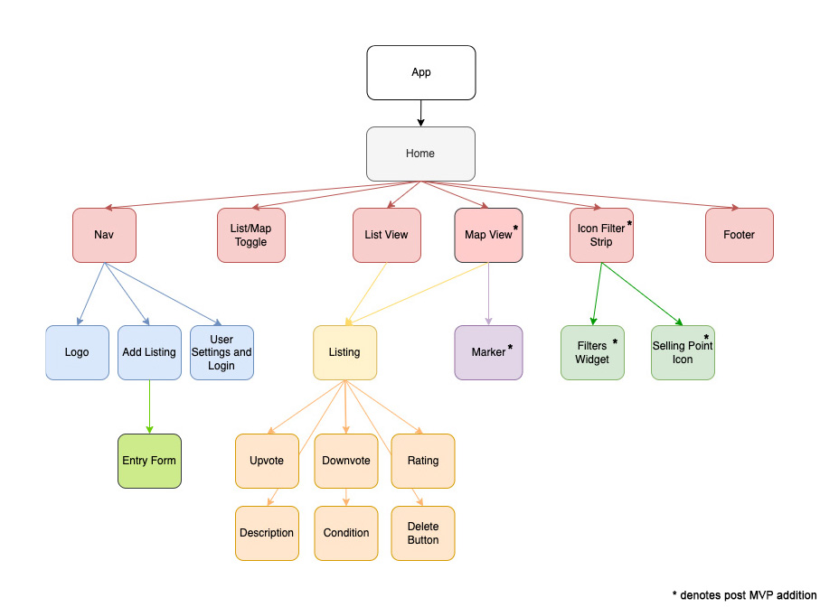
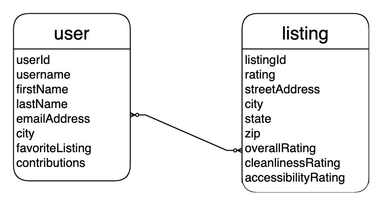

# Crapple Maps

## Date: 07/29/2022

### By: Austin Taylor

[Website](http://wwww.austinrt.io) | [GitHub](https://github.com/austin-rt) | [LinkedIn](https://www.linkedin.com/in/austinrt/)

### **_Deployed Site_**

[Crapple Maps](https://crapple-maps.herokuapp.com/)

---
### **_Description_**

The MVP form of this application will function as a simple crowdsourced public restroom locator. It will be the Wikipedia of public restrooms.

When a user is in need of a public restroom, they will be able to access the database in list form and filter by city and rating. If a listing is perceived as inaccurate, users will be able to update or delete the listing.

A post MVP version sees user authentication and a social media layer on top of the current idea.

### Intended Crud Functionality

- Create - user can create listing
- Read - user can view listings
- Update - user can add additional photos/reviews/ratings
- Delete - user can delete listings

### **_Technologies Used_**

- MongoDB + Mongoose
- Express.js
- React.js
- Node.js

#### **_Component Hierarchy Diagram:_**

#### **_Entity Relationship Diagram:_**

### **_Screen Shots_**

##### Landing Page

##### Listings Page

##### Individual Listing Page

##### Add Listing Page

##### Delete Listing

### **_Sources_**

Style and organization will be inspired by [Airbnb's](https://www.airbnb.com) 2022 styling.

### ***Trello Board***

[Crapple Maps Trello Board](https://trello.com/b/xqud8mOJ/crapple-maps)

 

### ***Future Features***
1. user authentication
2. map view
3. proximity filter
4. programiatically averaged ratings
5. user to user interaction (post / comment / like / dislike)

### ***License***

MIT License

###### Copyright &copy; 2022 Austin Taylor